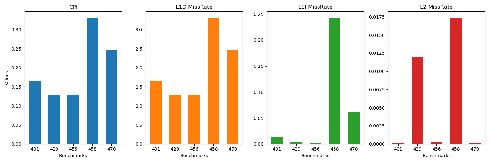
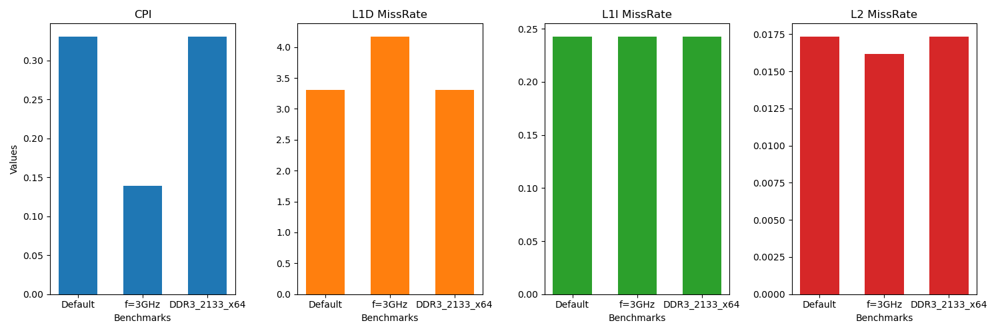

# Αναφορά εργασίας GEM5 2024-2025
Για το μάθημα "Αρχιτεκτονική Προηγμένων Υπολογιστών και Επιταχυντών".
Όνομα: Ιωακειμίδης Χρήστος.

## Μέρος 1ο
#### Υποσημείωση
Στην εργασία χρησιμοποιήθηκε η νέα έκδοση του GEM5 η οποία εγκαταστάθηκε locally. Παρουσιάστηκαν incompatibilities μεταξύ μερικών syscalls που παράγονται από τον compiler `arm-linux-gnueabifh-gcc`, οπότε για όλα τα executables χρησιμοποιήθηκε 64-bit αρχιτεκτονική, συγκεκριμένα με χρήση του compiler: `CC=aarch64-linux-gnu-gcc`

Τα αποτελέσματα του run για το hello world βρίσκονται στην τοποθεσία `part1/hello_run`
### Βήμα 2ο
### Ερώτημα 1
Βασική λειτουργία του script είναι η δημιουργία ενός βασικού syscall emulation environment, by default δημιουργεί ένα σύστημα με 1 core. Βασικές παράμετροι του γενικού συστήματος είναι η συχνότητα του συστήματος (1GHz) και η τάση αναφοράς (3.3V). Οι κύριες οντότητες που παράγονται και ρυθμίζονται είναι η CPU (που έχει την επιλογή να είναι πολυπύρινη), οι παράμετροι των cache (L1 και L2), το cache line size αυτών  και το memory bus, το οποίο συνδέει τις cache με την κύρια μνήμη. 

Από το script φαίνονται οι default παράμετροι:
| Παράμετρος | Default value | 
|--|--|
|Τύπος CPU | Atomic (no cache)|
|Συχνότητα CPU | 4GHz | 
|Πλήθος cores | 1 |
|Τεχνολογία κύριας μνήμης| DDR3_1600_8x8|
|Πλήθος των memory channels | 2 |
|Πλήθος memory ranks | None (1 rank)| 
|Μέγεθος κύριας μνήμης | 2GB|
|Tarmac (debugging and tracing tool) I/O files| stdout|

### Ερώτημα 2
####  Μέρος a)

| Παράμετρος | Αντίστοιχο πεδίο στο config.ini |
|--|--|
|Συχνότητα συστήματος | `system.clk_domain.clock` (period in ticks)|
|Τάση αναφοράς | `system.voltage_domain`|
|Τύπος CPU |`system.cpu_cluster.cpus.type`|
|Συχνότητα CPU|`system.cpu_cluster.clk_domain.clock`(period in ticks)|
|Πλήθος cores|Με βάση το `cpu_id`|
|Τεχνολογία κύριας μνήμης|`system.mem_ctrls0.dram.type`|
|Πλήθος memory channels|Πλήθος των entities στο `system.memories`|
|Πλήθος memory ranks|`system.mem_ctrls0.dram.ranks_per_channel`|
|Μέγεθος μνήμης|`system.mem_ctrls0.dram.device_size`|

### Μέρος b)
| Όρος | Ορισμός |
|--|--|
| `sim_seconds` | Τα δευτερόλεπτα που εξομοιώθηκαν σε χρόνο simulation. |
| `sim_insts` | Το πλήθος των εντολών που εκτελέστηκαν στην προσομοίωση. |
| `host_inst_rate` | Ο ρυθμός με τον οποίο εκτελεί εντολές ο προσομοιωτής. |
Τα `sim_seconds` αναφέρονται σε χρόνο προσομοίωσης ενώ το `host_inst_rate` σε πραγματικό χρόνο.

#### Μέρος c)
Αθροίζοντας τα fields:
`system.cpu_cluster.cpus.fetch2.*Instructions` με `*={Int,load,store}` παίρνουμε τον συνολικό αριθμό decoded εντολών που είναι `I_dec=5541+1820+834`, ενώ το σύνολο των commited εντολών είναι `num_Ops=5841`. Το πλήθος των εντολών που αποκωδικοποιήθηκαν είναι μικρότερο από αυτών που κρατήθηκαν αφού η CPU χρησιμοποιεί branch predictor, οπότε σε κάθε mispredicted branch ένα σύνολο από τις decoded εντολές δεν γίνεται commit.

#### Μέρος d)
Το πλήθος των προσπελάσεων της L2 cache δίνεται από το field `system.cpu_cluster.l2.demandAccesses::total=480`.
Αθροίζοντας τον συνολικό αριθμό των misses της L1 data cache και L1 instruction cache, έχουμε:
`system.cpu_cluster.cpus.dcache.overallMisses::total=179`+
`system.cpu_cluster.cpus.icache.overallMisses::total=332`=480, αφού η L2 cache προσπελάσσεται μόνο όταν το περιεχόμενο που ζητείται δεν βρίσκεται στο L1.

### Question 3
#### CPU μοντέλα (μόνο in-order)
|Model | Description|
|--|--|
|SimpleCPU | Ένα minimal, functional μοντέλο του οποίου ο κύριος σκοπός είναι το functional testing και όχι η απόδοση. Χρησιμοποιείται και σε warm-up perdios. Δεν υπάρχει pipelining. Δεν μπορεί να χρησιμοποιηθεί από μόνη της σαν κλάση. Αποτελεί την βασική δομή από την οποία παράγονται οι 2 παρακάτω κλάσεις, οι οποίες ορίζουν τον τρόπο με τον οποίο μοντελοποιείται το memory access και μπορούν να χρησιμοποιηθούν.|
|AtomicSimpleCPU |H πρώτη εκδοχή της SimpleCPU. Εδώ τα memory accesses μοντελοποιούνται προσεγγιστικά και όχι με ακρίβεια. |
|TimingSimpleCPU | Η δεύτερη εκδοχή της SimpleCPU. Τα memory accesses μοντελοποιούνται με μεγαλύτερη ακρίβεια, καθώς προσομοιώνεται το interaction με τα memory components. Είναι πιο ακριβή υπολογιστικά. Μοντελοποιεί και τα queue delay και resource contention.|
|Minor CPU | Fixed pipeline, single-threaded CPU. To pipeline: (Fetch1)->(Fetch2)->(Decoding)->(Execution). Το στάδιο Fetch1 κρατά ένα cache line της Instruction cache και το Fetch2 κρατά 1 εντολή. Χρησιμοποιείται tournament branch predictor στο στάδιο Fetch2, το οποίο επικοινωνεί με το στάδιο Fetch 1 για το prefetching σε περίπτωση κακής πρόβλεψης. Το execution stage είναι επίσης pipelined. Υπάρχουν διάφορα pipeline queues για τα execution units που χρησιμοποιούνται. Τα queues χρησιμοποιούνται σε round robin style και για τα dependencies χρησιμοποιείται scoreboard.|

Τα αποτελέσματα για τα runs αυτού του ερωτήματος βρίσκονται στην τοποθεσία `part1/1_[cpu_type]_[mod]`. Όπου mod είναι είναι `2clk` για διπλάσια συχνότητα ρολογιού, είναι `ddr4` για νέα τεχνολογία μνήμης. Ο source code, για το Fibonacci βρίσκεται στην τοποθεσία `part1/src`.

#### Μέρος a)
Για την εκτέλεση του προγράμματος στα 2 μοντέλα οι χρόνοι είναι οι:
|Model| `sim_seconds`|`host_seconds`|
|---|---|---|
|TimingSimpleCPU|0.001045|0.37|
|MinorCPU|0.000407|0.90|

Όπως ήταν αναμενόμενο, το μοντέλο MinorCPU πετυχαίνει καλύτερο χρόνο προσομοίωσης, καθώς είναι πιο αποδοτικό μοντέλο, αλλά λόγω της μεγαλύτερης πολυπλοκότητας σε σχέση με την TimingSimpleCPU, ο χρόνος που απαιτείται από το GEM5 για την προσομοίωση είναι υπερδιπλάσιος.

#### Μέρος b)
Κάποια άλλα αποτελέσματα που παρατηρούνται είναι τα:
|Model|`system.cpu.cpi`|`dcache.OverAllMissRate`|
|--|--|--|
|TimingSimpleCPU|3.037022|0.008217|
|MinorCPU|1.182743|0.015626 |

Η διαφορά στο CPI είναι λογική αφού το καλύτερο μοντέλο πετυχαίνει καλύτερη απόδοση. Παρατηρείται επίσης μια μικρή διαφορά στα memory accesses. Παρατηρείται χειρότερο MissRate στην MinorCPU. Η υπόθεση είναι ότι οφείλεται στο warmup perdiod που χρειάζεται ο branch predictor. 

#### Μέρος c)
Για την TimingSimpleCPU:
|Configuration|`sim_seconds`|`cpi`|`dcache.AvgMissLatency`|
|--|--|--|--|
|f=1GHz,DDR3_1600_x64|0.001045|3.037022|57380|
|f=2GHz,DDR3_1600_x64|0.000564|3.275437|76489|
|f=1GHz,DDR4_1600_x64|0.001055|3.064605|70077|

Αυξάνοντας τη συχνότητα του ρολογιού ο χρόνος εκτέλεσης μειώνεται. Σχεδόν υποδιπλασιάζεται. Αυτό δείχνει ότι δεν υπήρχε memory bottleneck. Φυσικά, το CPI αυξάνεται ελαφρώς καθώς το ρολόι της κύριας μνήμης δεν έχει αλλάξει, οπότε το μέσο latency αυξάνεται λόγω γρηγορότερης ζήτησης δεδομένων από την CPU. Δεν γνωρίζω γιατί παρατηρούνται χειρότερα αποτελέσματα με χρήση DDR4 αντί για DDR3.

Για την MinorCPU:
|Configuration|`sim_seconds`|`cpi`|`dcache.AvgMissLatency`|
|--|--|--|--|
|f=1GHz,DDR3_1600_x64|0.000407|1.182743|43845|
|f=2GHz,DDR3_1600_x64|0.000232|1.350922|54554|
|f=1GHz,DDR4_1600_x64|0.000409|1.188757|46778|

Παρατηρείται η ίδια συμπεριφορά που φάνηκε στην TimingSimpleCPU.

## Μέρος 2ο

### Βήμα 1ο
Τα scripts και runs για αυτό το βήμα βρίσκονται στην τοποθεσία `part2`.

### Ερώτημα 1
Βλέποντας ένα `config.ini` αρχείο οι παράμετροι των εκτελέσεων είναι οι:

|Παράμετρος| `config.ini` field | Τιμή |
|--|--|--|
|dCache Size|`system.cpu.dcache.size`|64kB|
|dCache associativity|`system.cpu.dcache.assoc`|2|
|iCache Size|`system.cpu.icache.size`|64kB
|iCache associativity|`system.cpu.icache.assoc`|2|
|L2Cache Size|`system.l2.size`|2MB|
|L2Cache associativity|`system.l2.assoc`|8|
|Cache line size|`system.cache_line_size`|64|

### Ερώτημα 2
Παρακάτω φαίνεται η συμπεριφορά των benchmarks:

Παρατηρείται μεγάλη συσχέτιση του CPI και του L1D Miss Rate, κάτι λογικό αφού οι επιρροές των υπόλοιπων παραγόντων απεικονίζονται στην απόδοση της data cache εν τέλει. 

### Ερωτήματα 3-4

Αυξάνοντας την συχνότητα του cpu-clock με βάση το `config.ini` αρχείο,  αλλάζει ο χρονισμός της CPU και των cache. Η συχνότητα του MMU και της DRAM παραμένει σταθερή, στα 1GHz. Αν προσθέταμε έναν 2ο επεξεργαστή, αυτός θα είχε το ρολόι που ρυθμίζουμε και όχι το default. Αυτός είναι και ο λόγος που δεν παρατηρείται τέλειο scaling. Το delay της μεταφοράς δεδομένων από την DRAM στην L2 cache παραμένει σταθερός. Να σημειωθεί πως τα αποτελέσματα για διαφορετικές μνήμες είναι υπερβολικά παρόμοια και νομίζω πως έχω κάνει κάποιο λάθος στο configuration αλλά λόγω έλλειψης χρόνου δεν έγινε 2ο run. 

### Βήμα 2ο

Αυτό το βήμα έγινε σε 2 φάσεις. Η βασική ιδέα είναι η μελέτη κάθε component ξεχωριστά σε κάποιο search space. Ο βασικός χώρος που εξετάστηκε ήταν ο εξής:
`l1_size=[32kB,64kB,128kB]`,
`l1d_assoc=[4,8,16]`,
`l1i_assoc=[2,4,8]`,
`l2_size=[512kB,1MB,2MB]`,
`l2_assoc=l1d_assoc`,
`cacheline_size=[32,64,128]`.

Το association της instruction cache επιλέχθηκε να είναι μικρότερο λόγω της σειρακής εκτέλεσης των εντολών. Για να περιοριστεί το search space. Επιλέχθηκε ένας σταθερός λόγος μεταξύ των μεγεθών των cache (`l1d_size=l1i_size=l2_size/8`). Για κάθε τέτοιο δυνατό configuration και για κάθε `cacheline_size`, έγιναν ξεχωριστά sweeps με βάση το association κάθε μνήμης. Από τα συνολικά αποτελέσματα, μετρήθηκαν σε κάθε component που εξεταζόταν, το miss rate και το avg delay. Με βάση τα παραπάνω configs (24 για κάθε component), βρέθηκε ο συνδυασμός για κάθε benchmark που ελαχιστοποιεί μία προσεγγιστική συνάρτηση της απόδοσης:
`cost=l1d_missrate*(l2_hit_delay+l2data_missrate*avg_penalty)+
l1i_missrate*(l2_hit_delay+l2instr_missrate*avg_penalty)`.
Τα βέλτιστα αποτελέσματα ίσως είχαν mismatches ως προς το cacheline size. Αλλά βέλτιστη προσέγγιση θεωρήθηκε αυτή της πλειοψηφίας των configurations.

Αυτές οι προσεγγίσεις είναι οι αρχικές τιμές για ένα 2ο search γύρο από αυτήν την λύση. Υπήρχε ένα bug στην αναζήτηση σε περίπτωση που το config έβγαινε εκτός των επιτρεπτών ορίων αλλά και πάλι έγινε μια εξερεύνηση της περιοχής γύρω από τις προσεγγιστικές λύσεις. Μετά από την αναζήτηση τα αποτελέσματα φαίνονται παρακάτω:

|Benchmark | CPI |DCache | ICache | L2 Cache | Cache line|
|--|--|--|--|--|--|
|401|1.534801|128kB, 64-way|128kB, 2-way|2MB, 32-way|256|
|429|1.171694|128kB, 64-way|128kB, 2-way|2MB, 64-way|512|
|456|1.263744|128kB, 64-way|128kB, 64-way|2MB, 2-way|512|
|458|3.247621|128kB, 64-way|128kB, 64-way|2MB, 64-way|128|
|470|1.445835|128kB, 4-way |128kB, 32-way|2MB, 2-way|512|

### Βήμα 3ο
Έχοντας τα παραπανω αποτελέσματα, θα οριστεί ως νεα συνάρτηση απόδοσης η `Performance=CPI/Cost`. Η συνάρτηση κόστους που ορίστηκε για μια cache μνήμη είναι η παρακάτω:
`Cost=c*(0.8*size+0.01*(size/cache_line)^2+0.1*(size/cache_line)*assoc^2)`
Η συνάρτηση έχει μια σταθερά c η οποία καθορίζεται από την ταχύτητα της τεχνολογίας που χρησιμοποιείται, έναν γραμμικό όρο για το memory array, έναν τετραγωνικό όρο ως προς το πλήθος των blocks για το addressing και τους multiplexers πανω στην επιλογή μιας διεύθυνσης block και έναν όρο που εκφράζει το κοστος που προσθετει το associativity (αυξάνεται τετραγωγικά σε σχέση με το associativity).
Καθώς η L2 cache έχει υποδεκαπλάσια latency values με βάση το config, επιλέχθηκε `c_L2=c_L1/10`. Ως νεα αντικείμενη συνάρτηση επιλέχθηκε η ποσότητα `CPI*Cost`.

Χρησιμοποιώντας τα ίδια run από παραπάνω, τα αποτελέσματα είναι τα παρακάτω (για `c=1e-3`):
|Benchmark |CPI| CPI*Cost |DCache | ICache | L2 Cache | Cache line|
|--|--|--|--|--|--|--|
|401|1.84|289.97|4kB, 16-way|128kB, 2-way|512kB, 2-way|256|
|429|1.19|257.94|128kB, 2-way|128kB, 2-way|64kB, 2-way|512|
|456|1.26|282.60|128kB, 2-way|128kB, 8-way|64kB, 64-way|512|
|458|3.24|1318.64|128kB, 4-way|128kB, 4-way|1MB, 16-way|128|
|470|1.44|133.16|32kB, 2-way |64kB, 2-way|128kB, 32-way|512|

Κάτι παράξενο είναι πως υπάρχουν αποτελέσματα που έχουν μικρότερη L2 cache από την L1. Αυτό οφείλεται ή στην αφθονία της μνήμης που υπάρχει στο σύστημα, είτε στην ελάχιστη επαναχρησιμοποίηση blocks χωρίς πολλά write backs (η L2 cache θα ήταν απλά ένα ενδιάμεσο στάδιο και είναι απλά κοστοβόρα). Υπάρχει και η πιθανότητα να έχει δωθεί υπερβολική έμφαση στο κόστος της L2  cache σε σχέση με την L1.

### Πηγές
* https://www.gem5.org/documentation/

